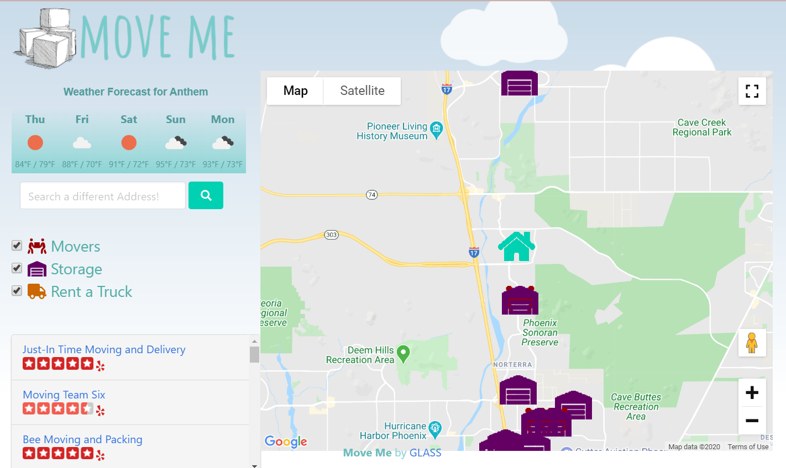

# Move Me App

The MoveMe app is a helpful tool for finding movers, storage, or where to rent a truck in your area.

# Contents
1. [User Story](#user-story)
2. [Usage](#usage)
3. [Built With](#built-with)
4. [Authors](#authors)

## User Story

As an individual with a busy schedule, I’m in need of assistance with my moving needs. I need to know where I can rent a truck nearby, find movers, find moving supplies or find a storage facility.

Deployed website can be found at [this link](https://move-me-by-glass.netlify.app/).

## Usage 
When first entering the site, user is able to get their current address. If entering an address as is in the search bar, address may autocomplete if need be.

Once address is searched, the main page appears with all options checked by default, and those options appear on the map as small icons.

Each icon on the map displays a different filter - movers, storage, and rent a truck, in the actual location. Any time an option is unchecked, those filters show on the screen along with their Yelp reviews, and the weather for that city.

## Built With

APIs:
- [Google Maps API](https://developers.google.com/maps/documentation/javascript/tutorial) - Pulls in locations of the city searched
- [Yelp API](https://www.yelp.com/developers) - Database used to connect google maps to places nearby and their reviews
- [Weather API](https://openweathermap.org/) - You are able to see the weather in the area you are moving to 

HTML/CSS:
- [Bulma](https://bulma.io/) - CSS framework used
- [fontawesome](https://fontawesome.com/) - used for the icons
- [Google Fonts](https://fonts.google.com/) - used for the title's font

## Authors
See the list of [contributors](https://github.com/Dayman628/move-me/graphs/contributors) who participated in this project.